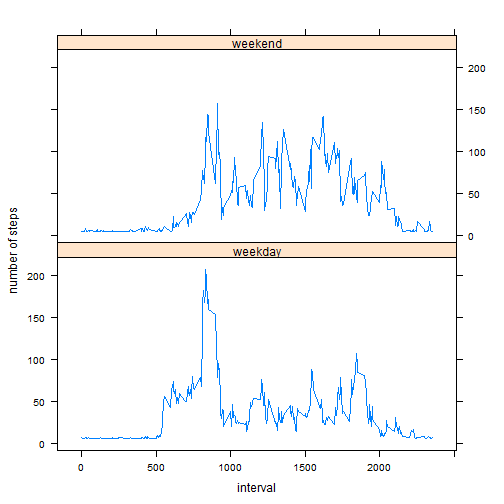

### Loading and preprocessing the data

```r
setwd("C:/Users/postdoc/Desktop/Data Science/Reproducible Research/")
file <- unzip("repdata-data-activity.zip")
data <- read.csv(file)
```
### Set Date column as class Date

```r
data$date <- as.Date(data$date,"%Y-%m-%d")
```
### install dplyr package

```r
#install.packages("dplyr")
library(dplyr)
```
### remove NA

```r
data_clean <- data[complete.cases(data),]
```
##  What is mean total number of steps taken per day?
- Calculate the total number of steps taken per day

```r
steps_stats <- data_clean %>% 
               group_by(date) %>% 
               summarise(sum = sum(steps), 
                         mean = mean(steps), 
                         median = median(steps))
```
- Make a histogram of the total number of steps taken each day

```r
hist(steps_stats$sum,xlab="number of steps",main="histogram of the total number of steps")
```

 

- Calculate and report the mean and median of the total number of steps taken per day

```r
mean_1 <- mean(steps_stats$sum)
median_1 <- median(steps_stats$sum)
```
Mean equals 1.0766189 &times; 10<sup>4</sup> and median equals 10765

## What is the average daily activity pattern?
- Make a time series plot (i.e. type = "l") of the 5-minute interval (x-axis) and the average number of steps taken, averaged across all days (y-axis)

```r
interval_stats <- data_clean %>% 
                  group_by(interval) %>% 
                  summarise(mean = mean(steps))
```

```r
plot(interval_stats$interval,interval_stats$mean,type="l",xlab="5-minute intervals",ylab="average number of steps taken",main="averaged across all days number of steps taken vs intervals")
```

 

- Which 5-minute interval, on average across all the days in the dataset, contains the maximum number of steps?

```r
interval_1 <- interval_stats[interval_stats$mean == max(interval_stats$mean),]$interval
```
Answer: the interval 835

### Imputing missing values
- Calculate and report the total number of missing values in the dataset (i.e. the total number of rows with NAs) 

```r
sum_1 <- sum(is.na(data))
```
Sum equals to 2304

- Strategy for filling in all of the missing values in the dataset: Replace missing values with the mean for that day, divided by number of 5-minute intervals. Create a new dataset that is equal to the original dataset but with the missing data filled in.

```r
new_data <- data
new_data[is.na(new_data)] <- mean_1/288
```
- Make a histogram of the total number of steps taken each day and Calculate and report the mean and median total number of steps taken per day. Do these values differ from the estimates from the first part of the assignment? What is the impact of imputing missing data on the estimates of the total daily number of steps?

```r
new_steps_stats <- new_data %>% 
                   group_by(date) %>% 
                   summarise(sum = sum(steps), 
                             mean = mean(steps), 
                             median = median(steps))

mean_2 <- mean(new_steps_stats$sum)
median_2 <- median(new_steps_stats$sum)
```
For data set without missing values: Mean equals 1.0766189 &times; 10<sup>4</sup> and median equals 10765

For the data set with filled in missing values: Mean equals 1.0766189 &times; 10<sup>4</sup> and median equals 1.0766189 &times; 10<sup>4</sup>

Means for two sets are identical, medians are close to each other, due to the choice of my filling in strategy for missing values. The impact of inserting missing values is in more exact representation of the data. 


```r
hist(new_steps_stats$sum,main="histogram of the total number of steps with missing values filled in",xlab="number of steps")
```

 

### Are there differences in activity patterns between weekdays and weekends?
- Create a new factor variable in the dataset with two levels -- "weekday" and "weekend" indicating whether a given date is a weekday or weekend day.

```r
weekdays_vector <- c('Monday', 'Tuesday', 'Wednesday', 'Thursday', 'Friday')
new_data$day_factor <- factor((weekdays(new_data$date) %in% weekdays_vector),levels=c(FALSE, TRUE), labels=c('weekend', 'weekday')) 
```
- Make a panel plot containing a time series plot (i.e. type = "l") of the 5-minute interval (x-axis) and the average number of steps taken, averaged across all weekday days or weekend days (y-axis). 

```r
new_interval_stats <- new_data %>% group_by(interval,day_factor) %>% summarise(mean = mean(steps))
```

```r
library(lattice)
attach(new_interval_stats)
```

```
## The following objects are masked from new_interval_stats (pos = 4):
## 
##     day_factor, interval, mean
```

```r
day.f <- factor(day_factor,levels=c("weekday","weekend"),labels=c("weekday","weekend"))
xyplot(mean~interval|day.f,xlab="interval",ylab="number of steps",layout=c(1,2),type="l")
```

 
